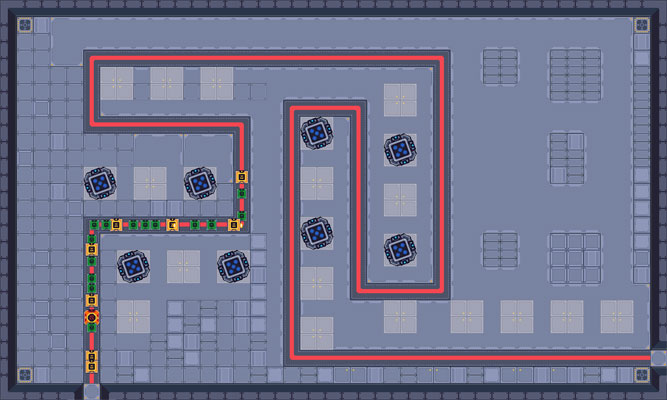

https://abenat1988.github.io/Classic-Tower-Defense/

# PROJECT IRONHACK | TOWER DEFENSE

<br>

## Introduction

this game has been created for the first project of IronHack WebDev Bootcamp (week 3).
this a classic Tower defense made in JS,CSS, HTML

<br><br>

## game's operation

### goal

you need to survive to 15 waves of ennemy.

each ennemy which arrives at the end of the path makes damages.
**if your life reach 0, you die.**

**nb**: to restart the game, you need to reload the index.html page (no back button on victory and defeat pages)

<br>

### Game Stats

| Name | value |
| ------------- | ------------- |
| Start Coin | 100 |
| Life | 10 |
| Waves | 15 |

<br>

### ennemy

| Name | image | life | damage | value |
| ------------- | ------------- | ------------- | ------------- | ------------- |
| Soldier |  | 5 | 1 | 10 |
| Tank |  | 20 | 2 | 30 |
| Boss |  | 15 | 5 | 40 |

<br>

### tower

| Name | image | range | damage | value | rate of fire
| ------------- | ------------- | ------------- | ------------- | ------------- | ------------- |
| Blue Tower |  | 5 | 1 | 50 | 10 |

<br><br>

## main Classes

### Game ###

**list of Properties**

```js
    constructor(money, heart) {
        this.map = null;
        this.monsterArray = [];
        this.towerArray = [];
        this.money = money;
        this.heart = heart;
        this.waveCounter = 0;
    }
   ```

* map
    * store the map object
* monsterArray
    * array that will store every monster objects that will be created during the game
* towerArray
    * array that will store every tower objects that will be created during the game
* money _(needs to be given as parameter)_
    * value used to create towers
* heart _(needs to be given as parameter)_
    * number of damage the player can receive before loosing the game
* waveCounter
    * value to store the number of wave already launched

**list of methods**

* start
    * generate map objects
    * update coin & health values on the player board (invoke method)
* launch
    * contains all intervals used to manage the game:
        * _movement of monsters_
            * for each monster of monsterArray invoke **moveMonster** from it
            * invoke **removeMonsterEndofWay** to manage monsters that arrive at the end
        * _distance between towers & monsters_
            * for each tower of towerArray
                * check if the tower has already a target
                    * if NOT, will check the distance between the tower and each monster, if a distance is lower that tower's range, set that monster as target and invoke **shoot** method from the tower
                        * the **some** method is used the select the closest ennemy from the end of the path
                    * if YES, will check if the distance from the current target is still under the range and invoke **shoot** method from the tower.
                        * if the distance is higher than the range, the target is lost and removed from the tower object
        * _movement of projectiles_
            * for each projectile of each tower, update the positionX or positionY based on X and Y coordinates of the projectile's target
* updateBoardText (queryselector of the element that needs to be update, new value)
    * change the inner text of an element in the DOM.
* spendMoney (number)
    * check if the argument can be substracted from player's amout. if yes, substract it.
    * return true of false. 
* earnMoney (number)
    * add argument to player's amout and invoke **updateBoardText** to update the board
* checkGameOver
    * check current health of the player and send him to game over page if equal to 0
* checkVictory
    * send the player to victory page if all waves has been launched and no more monster on monsterArray 
* increaseWave
    * increase **waveCounter** value and update the board
* createTower (event)
    * create new tower object, based on the spot's event.
    * use X & Y position that are stored in the DOM element
* removeMonsterEndofWay
    * compare current monster's position to the last object of waypoint of the map (the end of the path)
    * if it matches, the monster is removed from the monsterArray and the DOM and its attack is substracted from player's health

<br>

### Map ###

**list of Properties**

```js
     constructor(wayPoint, towerspot, waveslist, squareDimension, numberSquareHeigth, numberSquareWidth) {
        this.wayPoint = wayPoint;
        this.towerspot = towerspot;
        this.waveslist = waveslist;
        this.squareDimension = squareDimension;
        this.numberSquareHeigth = numberSquareHeigth;
        this.numberSquareWidth = numberSquareWidth;
        this.createDomElementMap();
        this.createDomElementTowerSpot();
    }
   ```

 * wayPoint _(needs to be given as parameter)_
    * Array of object that lists all point where ennemies will have to change direction
        * X coordinate
        * Y coordinate
        * new direction for the ennemy
    * the spawn and end for the path are included
 * towerspot _(needs to be given as parameter)_
    * Array of object that list all points where a tower can be placed
        * X coordinate
        * Y coordinate
 * waveslist _(needs to be given as parameter)_
    * nested Arrays that stores the content of each wave. each array is one wave. 
    * 2 values are stored:
        * number: time (in millesecond) before the next ennemy
        * string: type of ennemy that needs to be created (soldier, tank or boss)
 * squareDimension _(needs to be given as parameter)_
    * size (in px) of one square in the map
 * numberSquareHeigth _(needs to be given as parameter)_
    * number of squares that composes the height of the map
 * numberSquareWidth _(needs to be given as parameter)_
    * number of squares that composes the width of the map

**list of methods**

* createDomElementMap
    * size (in px) the div that will contain the map, based on **numberSquareHeigth**, **numberSquareWidth** and **squareDimension**
* createDomElementTowerSpot
    * create one div for each spot of tower and add the correct **left** and **bottom** values. Based on **towerspot** array
    * X & Y position are added in the DOM element to allow listener to find them for tower creation.

<br>

### Tower ###

**list of Properties**

```js
    constructor(power, range, positionX, positionY) {
        this.power = power;
        this.range = range;
        this.cost = 50;
        this.projectilesArray = [];
        this.isTargetAcquired = false;
        this.target = null;
        this.positionX = positionX * game.map.squareDimension + game.map.squareDimension;
        this.positionY = positionY * game.map.squareDimension + game.map.squareDimension;
        this.width = 2;
        this.towerElm = null;
        this.createDomElementTower();
    }
   ```

* power _(needs to be given as parameter)_
    * number of damage each projectile of that tower makes
* range _(needs to be given as parameter)_
    * distance under which a tower can reach an enemy (in square)
* positionX _(needs to be given as parameter)_
    * value in X axis where the tower will be placed (at the creation of the object, the value is in square and is changed to pixel after)
    * that value refers to the center of the element
* positionY _(needs to be given as parameter)_
    * value in Y axis where the tower will be placed (at the creation of the object, the value is in square and is changed to pixel after)
    * that value refers to the center of the element
* cost
    * the value that will be subtracted from the money of the player
* projectilesArray
    * array that will contain the projectile objects the tower shoots
* isTargetAcquired
    * boolean which indicates if the tower has a target or not
* target
    * refers to the ennemy object the tower has as target
* width
    * size of the tower (used for DOM)
* towerElm
    * refers to the DOM element of the object

**list of methods**

* createDomElementTower
    * create a div for the tower and add the correct **left** and **bottom** values, based on **positionX** and **PositionY**
* shoot
    * create a new projectile object and add it on projectilesArray 
* setDamage (projectile object as argument)
    * check if position of argument is equal to the position of the targeted ennemy. 
    * In that case:
        * reduce health of the ennemy based on tower's damage (stored in projectile)
        * remove the current projectile from the tower's array and remove it from the DOM
            * **a test is made to make sure that the projectile has not been already removed**
        * test the health of the ennemy. 
        * In that case:
            * add money based on ennemy's value, set alreadyDestroyed propertie (of the ennemy) to True. 
                * **a test is made to make sure that the ennemy is not already killed (and avoid give money multiple times)**
            * invoke killCurrentProjectiles method to remove the rest of projectiles
            * remove the ennemy from the main ennemy's array and remove it from the DOM
                * **a test is made to make sure that the ennemy has not been already removed**
* killCurrentProjectiles
    * remove other projectile of the array from the DOM and clean the array

<br>

### BlueTower (extention of Towwer) ###

that object is used to store following properties of Tower on a dynamic way, because they depend on the type of tower: 
* power 
* range

<br>

### Monster ###

**list of Properties**

```js
    constructor(type, health, attack, revenu, width, positionX, positionY) {
        this.type = type;
        this.health = health;
        this.attack = attack;
        this.revenu = revenu;
        this.monsterElm = null;
        this.alreadyDestroyed = false;
        this.positionX = positionX * game.map.squareDimension + game.map.squareDimension / 2;
        this.positionY = positionY * game.map.squareDimension + game.map.squareDimension / 2;
        this.width = width;
        this.movementDirection = null;
        this.createDomElementMonster();
    }
   ```

* type _(needs to be given as parameter)_
    * indicate the type of ennemy that will be created (soldier, tank or boss). it's used to select the correct class at the DOM creation
* health _(needs to be given as parameter)_
    * indicate the number of damage the object needs to receive before beeing killed
* attack _(needs to be given as parameter)_
    * indicate the number of damage the ennemy will make if it arrives at the end of the path
* revenu _(needs to be given as parameter)_
    * the amount of money the player will earn when the ennemy is destroyed
* width _(needs to be given as parameter)_
    * size of the ennemy (used for DOM)
* positionX _(needs to be given as parameter)_
    * value in X axis where the ennemy is on the map (at the creation of the object, the value is in square and is changed to pixel after)
    * that value refers to the center of the element
* positionY _(needs to be given as parameter)_
    * value in Y axis where the ennemy is on the map (at the creation of the object, the value is in square and is changed to pixel after)
    * that value refers to the center of the element
* monsterElm
    * refers to the DOM element of the object
* alreadyDestroyed
    * boolean that tells if the ennemy is killed or not (used to avoid being killed multiple times)
* movementDirection
    * indicate the direction (top, bottom, left or right) the ennemy is moving

**list of methods**

* createDomElementMonster
    * create a div for the ennemy and add the correct **left** and **bottom** values, based on **positionX** and **PositionY**
* moveMonster
    * compare the current position of the ennemy to the waypoint array in order to give it a new direction when a waypoint is reached
    * update the positionX or positionY based on the direction the ennemy takes

<br>

### Soldier (extention of Monster), Tank (extention of Monster), Boss (extention of Monster) ###

all those objects are used to store following properties of Monster on a dynamic way, because they depend on the type of monster: 
* type 
* health 
* attack 
* revenu 
* width 

<br>

### Projectile###

**list of properties**

```js
    constructor(sourceTower, target) {
        this.positionX = sourceTower.positionX;
        this.positionY = sourceTower.positionY;
        this.projectileElm = null;
        this.width = 10;
        this.target = target;
        this.damage = sourceTower.power;
        this.createDomElementProjectile();
    }
   ```
* positionX _(needs to be given as parameter with sourceTower object)_
    * value in X axis where the projectile is on the map 
    * that value refers to the center of the element
    * at the declaration, that value is based on the position of the parent's tower
* positionY _(needs to be given as parameter with sourceTower object)_
    * value in Y axis where the projectile is on the map 
    * that value refers to the center of the element
    * at the declaration, that value is based on the position of the parent's tower
* projectileElm
    * refers to the DOM element of the object
* width
    * size in px of the element (used of the DOM)
* target _(needs to be given as parameter )_
    * refer the Monster object where the projectile is launch 
* damage _(needs to be given as parameter with sourceTower object)_
    * the value that will be subtracted from the health of the target

**list of methods**

* createDomElementProjectile
    * create a div for the projectile and add the correct **left** and **bottom** values, based on **positionX** and **PositionY**

<br><br>

## next features

* create back buttons for game-over & victory pages
* return money and number of waves done in victory page
* improve game balances
* launch next waves automaticaly when the previous one is killed (and give to player a bonus if he launches the wave before finish the previous one)
* add other type of tower (different damage, range, cost) and let the player select which tower place where
* add multiple maps
* add a level feature for the tower that increase damage AND/OR range
* add a level feature for the monster that increase damage AND/OR range
* make the game responsive and touch screen friendly
* add sound

<br><br>

## Credits & Resources

### Credits

special thank to Chris from the YT channel Chris Courses (https://www.youtube.com/@ChrisCourses). his video about Tower defense tutorial helped me a lot: https://www.youtube.com/watch?v=C4_iRLlPNFc

**IMPORTANT:** only the creation of the map & the waypoint logic were taken from his work.

**no piece of code has been reused**

<br>

### ressources

creation of the map: https://www.mapeditor.org/

asset for tower, map, ennemy & projectiles: https://pillowbyte.itch.io/diceforce-free-assets